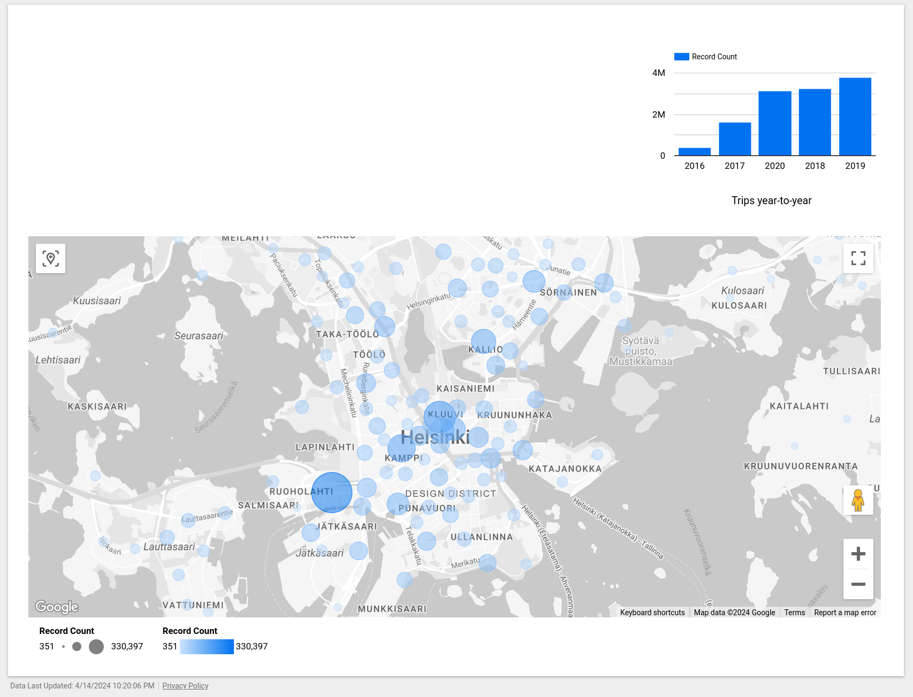

## Problem (Imagined ofcourse)
As a part of Helinski city effort to encourage the usage of sustainable transportation methods, and to reduce the dependency on cars, the city is trying to promote the usage of bike share solutions for last mile trips.
To monitor the adoption and the sucess of such solutions in Helinsky, the bearu of transportation needs a dashboard that summarizes the trends of using bike share solutions, based on trips data for years 2016-2020, before covid lockdown.

In order to have a better understanding of the solution adoption, the following is required:
- A graph showing the total trips year-to-year
- A map showing the popularity of each station: how much trips were made from each station.


## Results



- The pipe line takes the raw data from CSV in a tar.gz file
- Then using spark, it reads the data and cleans it, adding missing departure_id based on station coordinates.
- Then it saves the cleaned data as parquet files to GCS, partitioned by year.
- Similarly, it will save the data into big-query table
    - The table is partitioned by year to reduce per-year query costs
    - And the clustering is done on departure_id, to facilate the map dashboard, which count trips by departure station.
- Data looker is used to create the dashboard as shown in the image
- You can view the dashboard from [here](https://lookerstudio.google.com/s/qkT3YTDP1qg)
    - unfortunately I couldn't find an easy way to automate the dashboard creation

## Requirements
- Google cloud account
- gcloud cli
- terraform

## Steps

- The Helsinki City bikes data set from [kaggle](https://www.kaggle.com/datasets/geometrein/helsinki-city-bikes?resource=download) is available on this [url](https://storage.googleapis.com/pfcllotsb7jsqqvbjrnw3s-datasets/bike-rides-data.tar.gz). The pipeline will load it automatically.


- In Google-Cloud-Services console, create a new project.


- Init your shell, gcloud tool and terraform
```shell
# Set the project name in shell
export GCS_PROJECT=<your-gcp-project-id>;
export GCS_REGION=<your-gcp-project-region>;

#login to gcs using gcloud tool
gcloud auth login;

#Set the current project to the one created
gcloud config set project $GCS_PROJECT;

#set the project for terraform in the current shell
export TF_VAR_project=$GCS_PROJECT;
export TF_VAR_location=$GCS_REGION;
```

- init terraform state file
```shell
terraform init
```

- Check changes to new infra plan. Notice that terraform commands must run in the same shell you used to login to GCS, in order to have credentials to access the cloud.
```shell
terraform plan
```

- Create new infra
```shell
terraform apply
```

- run the notebook using dataproc
```shell
# copy the pipeline script to GCS
export SPARK_JOB=gs://$GCS_PROJECT-datalake/process_bikes-trips.py;
gsutil cp ./process_bikes-trips.py $SPARK_JOB;

gcloud dataproc jobs submit pyspark $SPARK_JOB --cluster=$GCS_PROJECT-dataproc --region=$GCS_REGION --jars=gs://hadoop-lib/bigquery/bigquery-connector-hadoop2-latest.jar,gs://spark-lib/bigquery/spark-bigquery-with-dependencies_2.12-0.30.0.jar; 
```

- When done, take down the infrastructure.
```shell
terraform destroy
```


# Resources

- BigQuery python client [documentation](https://cloud.google.com/python/docs/reference/bigquery/latest/google.cloud.bigquery.client.Client#google_cloud_bigquery_client_Client_load_table_from_dataframe)
- [Creating dataproc cluster using terraform](https://medium.com/google-cloud/deploying-google-cloud-dataproc-with-terraform-what-why-and-how-74e26366d092)